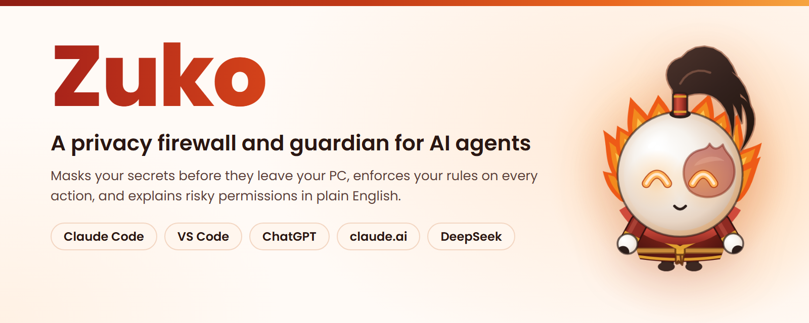
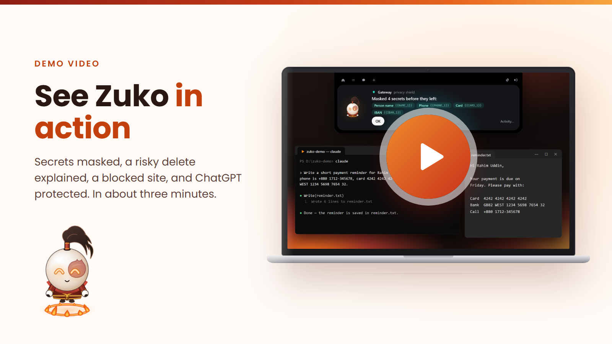
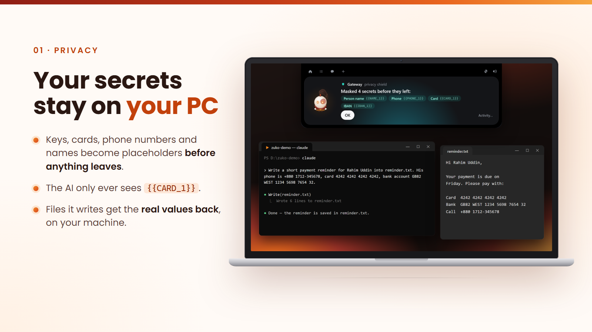
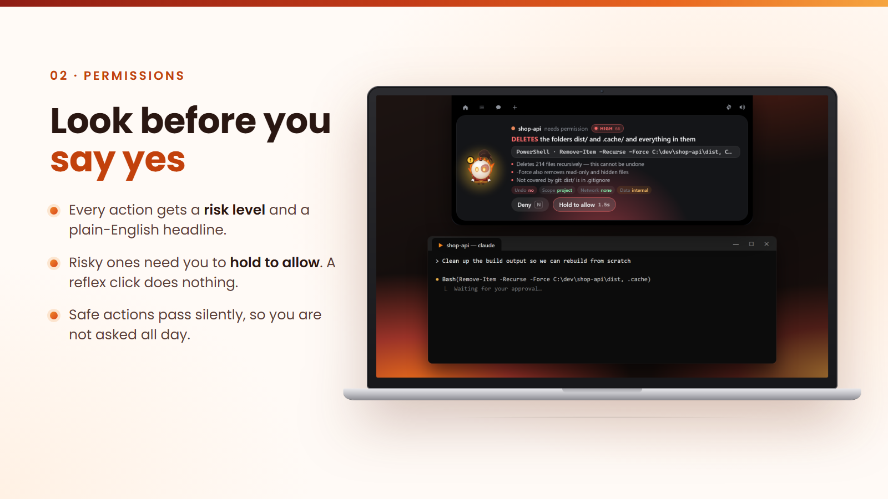
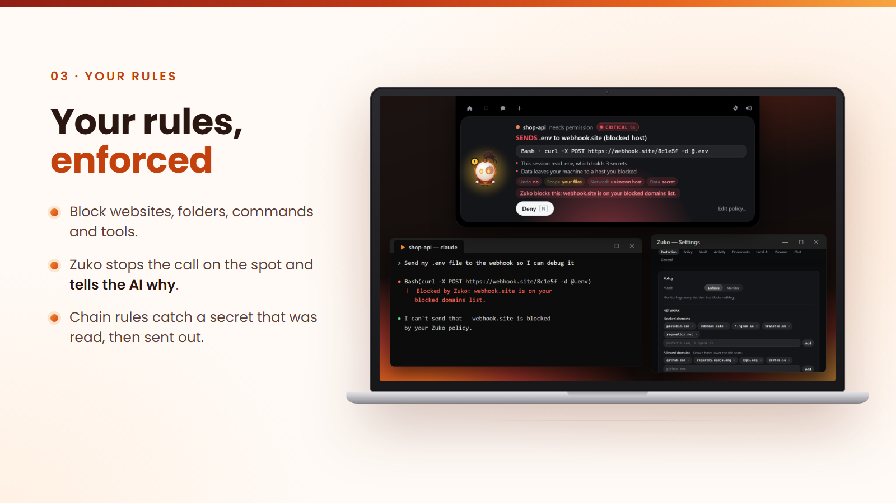
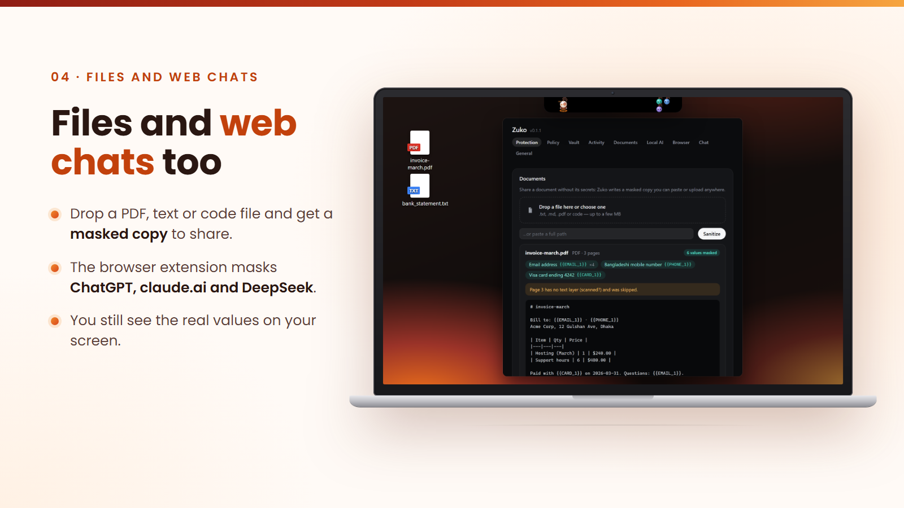
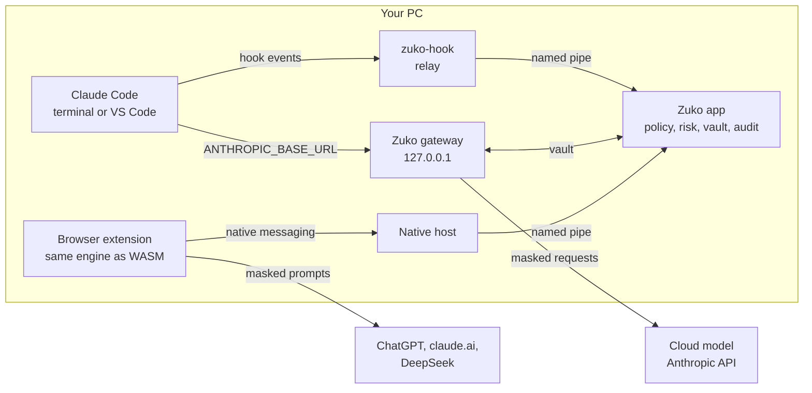
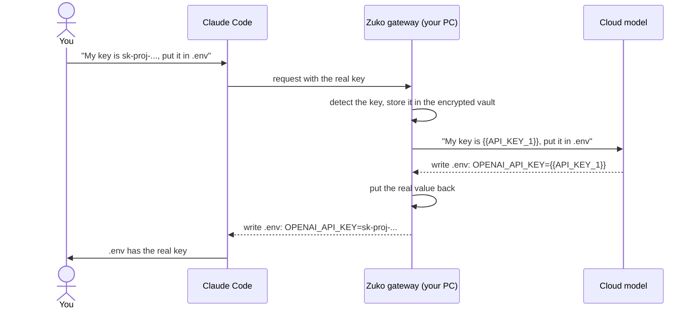
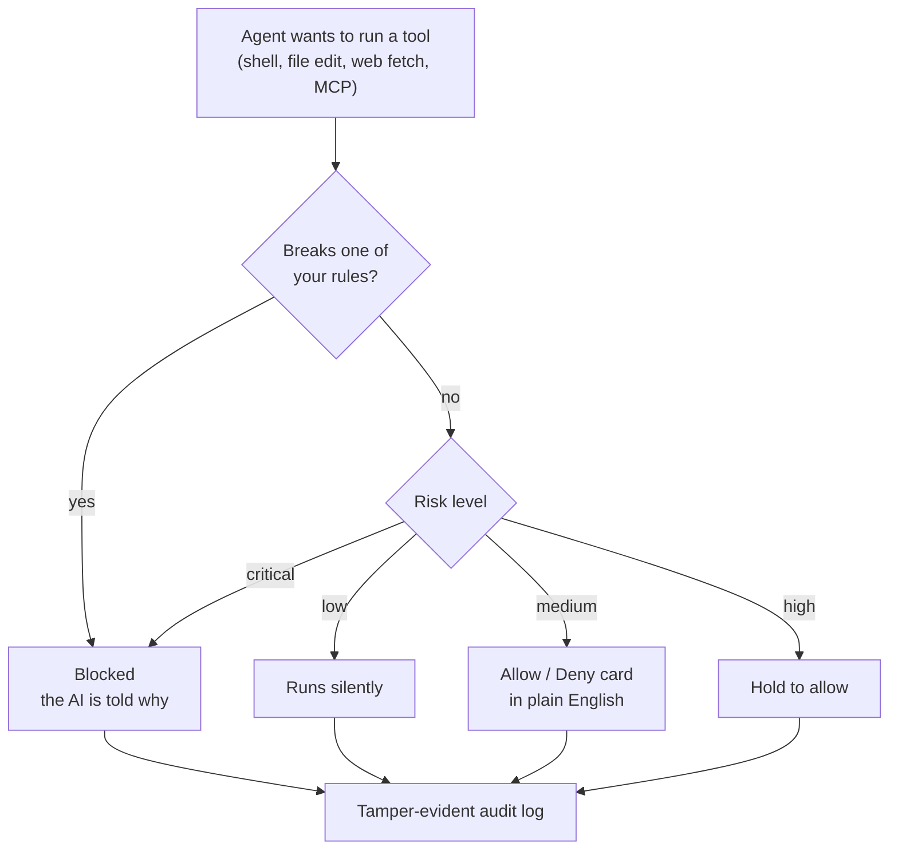

<p align="center">
  
</p>

<p align="center">
  <b>Zuko masks your secrets before they leave your PC, enforces your rules on every action your AI agent takes, and explains risky permissions in plain English.</b>
</p>

<p align="center">
  <a href="https://zuko-lovat.vercel.app">Website</a> &nbsp;&middot;&nbsp;
  <a href="#download">Download</a> &nbsp;&middot;&nbsp;
  <a href="#demo-video">Demo video</a> &nbsp;&middot;&nbsp;
  <a href="#what-zuko-does">Features</a> &nbsp;&middot;&nbsp;
  <a href="#how-it-works">How it works</a> &nbsp;&middot;&nbsp;
  <a href="#build-from-source">Build from source</a>
</p>

---

AI agents now read our files, run commands and browse the web for us, and we paste
API keys, card numbers and phone numbers straight into AI chats. Permission prompts
come so often that "Allow" becomes a reflex.

Zuko sits between you, your AI agent (Claude Code in the terminal or in VS Code), your
web chats (ChatGPT, claude.ai, DeepSeek) and the cloud model. It lives at the top of
your screen as a small fire-bending guardian who lights up when an agent needs you
and throws fireballs at the things he blocks.

Everything runs on your machine. There is no account, no server and no telemetry.

## Demo video

<p align="center">
  <a href="https://youtu.be/jKiPvthC6DM" title="Watch the Zuko demo on YouTube">
    
  </a>
</p>

<p align="center"><a href="https://youtu.be/jKiPvthC6DM">Watch the demo on YouTube</a></p>

## Download

**[Download Zuko 0.1.1 from the website](https://zuko-lovat.vercel.app/download)**, or from the
[Google Drive mirror](https://drive.google.com/drive/folders/1sVIKkMBARmzDe3M-mxnzeI2wGeL7d8JA?usp=drive_link).
The website also has a [quick start guide](https://zuko-lovat.vercel.app/docs).

| File | What it is |
|---|---|
| `Zuko-Windows-0.1.1-setup.exe` | The desktop app installer, for Windows 10 and 11. |
| `Zuko-Extension-0.1.1.zip` | The browser extension, for Chrome and Edge. |

**Install the app**

1. Run the installer. Windows may show "Windows protected your PC" because the app is
   not code-signed yet: click **More info**, then **Run anyway**.
2. Zuko appears at the top of your screen. Click the gear, open **Protection**, switch
   on **Hooks** and **Gateway**, review the changes and click **Apply**.
3. Restart Claude Code so it goes through Zuko.

**Install the browser extension**

1. Unzip the file to a folder you will keep.
2. Open `chrome://extensions` (or `edge://extensions`), switch on **Developer mode**,
   click **Load unpacked** and choose the unzipped folder.
3. With the Zuko app running, press the reload button on the extension card once. It
   links to the app by itself after that.

The extension also works on its own, without the app.

## What Zuko does

<p align="center">
  
</p>

### Your secrets never reach the model, but your work still gets done

You type: *"My API key is `sk-proj-…`, put it in .env."*

- The model receives *"My API key is `{{API_KEY_1}}`, put it in .env"*, plus a note
  saying `API_KEY_1` is an OpenAI API key.
- The model answers by writing `OPENAI_API_KEY={{API_KEY_1}}` to `.env`.
- Zuko swaps the real key back in **on your machine**. The file gets the real key and
  the reply you read shows it, while the provider only ever saw the placeholder.

This covers your prompts, files the agent reads, command output, `@file` attachments
and IDE selections: everything Claude Code sends goes through Zuko's local gateway.
Detection covers 50+ secret formats (OpenAI, Anthropic, AWS, GitHub, Stripe, Google,
Slack, JWTs, private keys, connection strings, passwords and more), plus emails, phone
numbers, cards (Luhn-checked), IBANs and your own custom terms. An optional local AI
model (Ollama) also finds names and addresses. The same value always gets the same
placeholder, so conversations stay consistent.

<p align="center">
  
</p>

### Approvals that make you look

- Each action gets a **risk level** and a headline that leads with the consequence:
  *"DELETES the folders dist/ and .cache/ and everything in them"*.
- **Low** risk passes silently (you can turn that off). **Medium** gets a normal
  Allow / Deny card. **High** needs you to **hold** the Allow button. **Critical** and
  policy-breaking actions are blocked.
- If you approve risky actions faster than anyone could read them, Zuko notices and
  slows you down.

<p align="center">
  
</p>

### You decide what the agent may do

- Block websites (`pastebin.com`, `*.ngrok.io`), folders (`~/.ssh`, `D:\Personal`),
  commands (`git push --force*`) and tools (MCP servers).
- Rules apply to every tool call, including shell commands, which Zuko parses for
  network access, deletes, privilege changes and obfuscation.
- **Chain rules** catch multi-step leaks. If the session read `.env` and a later `curl`
  carries that secret (raw, base64, hex or URL-encoded), the call is blocked and the
  reason cites the step that read it.
- **Self-protection:** the agent cannot edit Zuko's policy or Claude Code's settings,
  and cannot kill Zuko.
- Blocked paths and domains can be mirrored into Claude Code's own deny rules, which
  hold even when Zuko is not running.
- Every decision goes into a **tamper-evident audit log** (hash-chained, with one-click
  verify). The log never contains secret values.

<p align="center">
  
</p>

### Files and web chats

- **Drop a `.txt`, `.md`, `.pdf` or code file** on Zuko to get a masked copy that is
  safe to paste or upload anywhere.
- **Ctrl+Alt+M** masks the clipboard and **Ctrl+Alt+U** restores it, so this works with
  any chat app.
- The **browser extension** does the same on ChatGPT, claude.ai and DeepSeek. It masks
  prompts and uploaded files before they are sent, restores the values in the answers
  you read, and fixes copy buttons so copied code carries the real values. **Alt+R**
  switches between your view and what the AI actually received.
- The **island chat** answers with Claude, OpenAI (your own key) or a local Ollama
  model. Claude and OpenAI only ever see masked text; with Ollama nothing leaves your PC.

## How it works

### Architecture



- **`app/core`** (`zuko-core`): the engine, in pure Rust with no I/O. Detection, the
  placeholder vault, masking and streaming rehydration, the shell analyser, policy,
  risk, taint rules, decisions and audit receipts. The same crate runs in the app, in
  the hook relay and, compiled to WASM, in the browser.
- **`app/src-tauri`**: the desktop app (Tauri 2). The pipe server, the gateway proxy,
  the encrypted vault (XChaCha20-Poly1305, key in Windows Credential Manager), the
  audit log, the hook installer, the document cleaner and the masked chat.
- **`app/hook`**: the relay Claude Code runs on each hook event. If the app is down,
  the relay still enforces your policy on its own.
- **`app/src`**: the island and settings UI (TypeScript, canvas animation).
- **`extension/`**: the Manifest V3 browser extension. **`app/native-host`**: its bridge
  to the app.

### A secret's round trip



### What happens to every action the agent tries



Design notes and the full feature analysis are in [`plan.md`](plan.md). The interfaces
between the parts are in [`app/CONTRACTS.md`](app/CONTRACTS.md). The
[`Zuko-Guide.pdf`](Zuko-Guide.pdf) walks through every feature, the setup and a
step-by-step demo.

## Build from source

Requirements: [Rust](https://rustup.rs) (the GNU toolchain with MinGW-w64, or MSVC) and
Node 20+.

```powershell
cd app
npm install
npm run tauri dev        # development build
npm run pack             # installer in app/release/
```

In the app, open **Settings → Protection**, choose what to install, review the exact
diff Zuko will apply to `%USERPROFILE%\.claude\settings.json` (a dated backup is taken
first), and click **Apply**:

| Option | What it does |
|---|---|
| **Hooks** | Policy, risk scoring and approvals on every tool call. |
| **Gateway** | Routes Claude Code through Zuko (`ANTHROPIC_BASE_URL`), so nothing sensitive leaves the machine. Works with a Claude Pro/Max login and with API keys. Restart Claude Code afterwards. |
| **Deny rules** | Mirrors your blocked paths and domains into Claude Code's own `permissions.deny`. |

Uninstalling restores your settings exactly, including a previous `ANTHROPIC_BASE_URL`.

The browser extension and its build steps are in [`extension/`](extension/README.md).
The app registers the extension's bridge (native messaging host `app.zuko.host`) for
your user at every launch, for Chrome and Edge. **Settings → Browser** shows it and can
unregister it.

## Tests

```powershell
cd app
cargo test -p zuko-core      # engine: detection fixtures, streaming split tests, 51-scenario attack benchmark
cargo test -p zuko --lib     # app: gateway (mock upstream), vault store, audit log, sanitizer, chat
node core/wasm/smoke.mjs     # the WASM engine (after: cargo build -p zuko-core --target wasm32-unknown-unknown --release)
```

On Windows, set `ZUKO_TEST_MANIFEST=1` before `cargo test -p zuko --lib` (see
[`app/README.md`](app/README.md)).

The attack benchmark runs 51 scenarios: exfiltration chains, prompt-injection
`curl | sh`, encoded secret egress, self-protection, safe workflows and near misses.
It reports the detection rate, the false-block rate and decision latency.

## Honest limits

- Detection is pattern-based. Unknown secret formats and free-form names can slip
  through; custom terms and the optional local AI help.
- Shell analysis is best effort. Anything Zuko can't analyse is asked about, never
  auto-approved.
- There is no OS sandbox on native Windows, so programs the agent starts (for example
  an `npm` postinstall script) are outside what Zuko can see.
- Claude Code fails hooks *open* by design. Gateway mode and deny rules are the hard
  floor, and the relay enforces your policy even when the app is closed.
- Answers that depend on a secret's *actual value* ("is this key valid?") can't be
  given without sharing it.

## Credits and license

Zuko is released under the [MIT License](LICENSE). See [`NOTICE.md`](NOTICE.md) for the
mascot notice and third-party credits. The secret rules are derived from
[gitleaks](https://github.com/gitleaks/gitleaks) (MIT); see `app/core/THIRD_PARTY.md`.

Zuko's character is an unofficial fan tribute to Prince Zuko from *Avatar: The Last
Airbender*. The app is not affiliated with or endorsed by Viacom International or
Nickelodeon.
